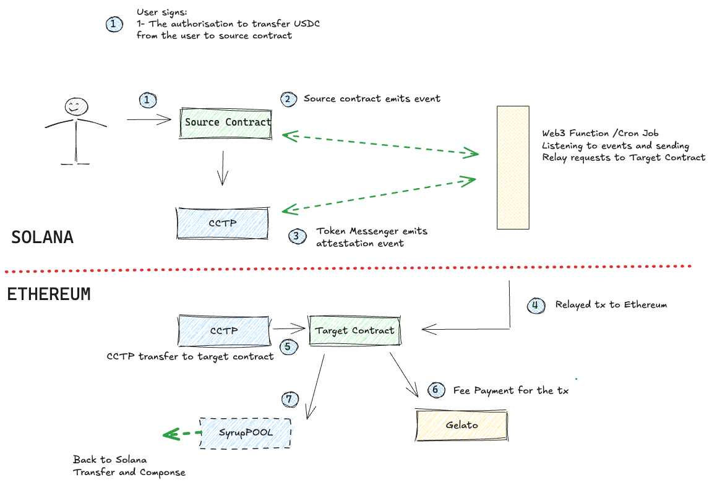

# Maple CCTP Bridge

This repository implements a cross-chain bridge for USDC using Circle's Cross-Chain Transfer Protocol (CCTP) and Gelato's relay service. The bridge enables users to deposit USDC into Maple pools across different chains.

## Architecture Overview



The system consists of four main components that work together to enable cross-chain USDC transfers:

1. **Bridge Script (`bridge_new.ts`)**
   - Handles the initial user interaction
   - Signs authorization for USDC transfer
   - Initiates the bridge process by calling the sender contract
   - **Flow**: User initiates transfer → Script signs authorization → Calls sender contract

2. **MapleCCTPSender Contract**
   - Receives USDC from users
   - Integrates with Circle's CCTP protocol
   - Handles the cross-chain transfer initiation
   - Uses EIP-3009 for secure token transfers
   - Emits events for the web3 function to track
   - **Flow**: Receives USDC → Burns tokens → Initiates CCTP transfer → Emits event

3. **Web3 Function (`mapple-cctp`)**
   - Monitors events from the sender contract
   - Relays transactions to the target chain
   - Handles the cross-chain message delivery
   - **Flow**: Detects transfer event → Relays transaction → Ensures message delivery

4. **MapleCCTPReceiver Contract**
   - Receives USDC on the target chain
   - Verifies CCTP messages and attestations
   - Forwards USDC to the Maple pool
   - Implements a vault system for secure token handling
   - **Flow**: Verifies message → Mints USDC → Forwards to Maple pool


## Technical Details

### Contracts

- **MapleCCTPSender**
  - Implements EIP-3009 for secure token transfers
  - Integrates with Circle's TokenMessenger
  - Handles cross-chain message formatting

- **MapleCCTPREceiver**
  - Implements GelatoRelayContext for relay integration
  - Verifies CCTP messages and attestations
  - Manages vault deployment and token forwarding

### Security Features

- EIP-3009 authorization for secure token transfers
- Vault system for isolated token handling
- Message attestation verification
- Gelato relay integration for reliable cross-chain execution

## Setup and Configuration

1. Install dependencies:
   ```bash
   npm install
   ```

2. Configure environment variables:

   In the root directory `.env`:
   - `ALCHEMY_KEY`: Your Alchemy API key
   - `PRIVATE_KEY`: Your wallet private key
   - `PROVIDER_URLS`: RPC URL for the target chain, needed for testing

   In `web3-functions/maple-cctp/.env`:
   - `ONEBALANCE_API_KEY`: Gelato 1Balance API Key for relay service
   - `SOURCE_RPC_URL`: RPC URL for the source chain

3. Deploy contracts:
   ```bash
   npx hardhat deploy
   ```

## Usage

To initiate a bridge transfer:

1. Ensure you have sufficient USDC balance
2. Run the bridge script:
   ```bash
   npx ts-node scripts/bridge_new.ts
   ```

## Network Support

- Source Chain: Base Sepolia
- Target Chain: Sepolia
- Supported Token: USDC

## License

MIT 